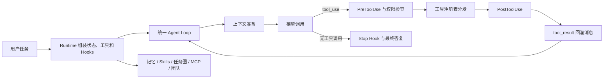

# HarnessAgent 项目面试准备

面向 AI Agent / 大模型应用开发岗位。回答时先说**要解决的问题**，再说**代码如何实现**，最后说**怎么验证、有什么边界**。下面的表述依据当前仓库，不包含尚未测出的性能收益。

## 一、开场怎么讲

### 30 秒版

> HarnessAgent 是一个用 Python 实现的编码 Agent 执行框架。我把模型调用、工具执行和结果回灌收敛到同一条 Agent Loop，再通过工具注册表、ToolContext 和 Hooks 接入权限、上下文压缩、长期记忆、Skills、MCP 和多 Agent 协作。主 Agent、子 Agent 和线程队友复用核心循环，但拥有各自的消息历史和工具权限。项目公开版本有 177 项离线测试，另外搭建了以外部验收为准的任务级评测脚手架。

### 90 秒版

> 我做这个项目，核心是解决编码 Agent 在多轮任务中“能调用模型，却难以稳定执行”的问题。单次模型回答之外，还需要工具调度、状态保存、上下文管理、权限约束和失败后的反馈。
>
> 架构上只有一处 Agent Loop：每轮准备上下文和工具定义，调用模型，执行模型提出的工具，再把结果追加回消息历史。它不直接知道工具的业务逻辑。Runtime 负责组装工具、状态和 Hooks；ToolContext 让同一套工具代码服务不同 Agent，同时隔离工作目录和权限。
>
> 我重点实现了五级上下文压缩和跨会话长期记忆。压缩先处理大工具结果和旧消息，必要时再调用模型总结；记忆则按“选择、提取、整合”分工，并阻止只对当前任务有效的信息落盘。协作方面，短生命周期子 Agent 用独立上下文完成一次性任务；线程队友通过任务依赖图和信箱持续工作，任务认领由进程内锁保护。MCP 工具连接后会动态加入工具池，下一轮模型调用即可看见。
>
> 验证上，我使用 MockLLM 做确定性的离线测试，并设计单 Agent 与团队、不同验证反馈、上下文压缩开关的对照评测。离线测试能证明机制和不变量，真实任务的效率收益还需要多任务、多次真实模型运行才能下结论。

### 一句话解释 Harness

模型决定下一步想做什么；Harness 负责提供工具、保存执行状态、控制权限、管理上下文，并把真实执行结果反馈给模型。本项目的重点是这套**执行环境和约束机制**。

## 二、架构图与代码入口



看代码的顺序：

1. [agent/loop.py](../agent/loop.py)：模型、工具和消息历史怎样闭环。
2. [agent/runtime.py](../agent/runtime.py)：工具、Hooks、记忆、压缩器和团队怎样接线。
3. [agent/tools/registry.py](../agent/tools/registry.py)、[agent/events.py](../agent/events.py)：扩展点。
4. [agent/context.py](../agent/context.py)、[agent/memory.py](../agent/memory.py)、[agent/skills.py](../agent/skills.py)：三种不同的上下文来源。
5. [agent/tasks.py](../agent/tasks.py)、[agent/teams.py](../agent/teams.py)、[agent/mcp.py](../agent/mcp.py)：协作和外部能力。

## 三、核心追问与参考回答

### 1. 为什么需要统一 Agent Loop？它每一轮做什么？

**回答：** 一轮依次执行：注入应到达的事件、准备上下文、重建系统提示词和工具定义、调用模型；若返回 `tool_use`，逐个执行并收集 `tool_result`，然后进入下一轮；若没有工具调用，则交给 Stop Hook 判断是否结束。主 Agent、子 Agent、队友共用 `run_loop`，差异由传入的消息、工具池、上下文和 Hooks 决定。这样新增能力主要接在循环外围，核心调度保持稳定。

**追问：一次返回多个工具调用怎么办？** 同一批调用都执行并收集结果，再追加一条包含全部 `tool_result` 的消息。若这一批包含主动 `compact`，要等本批结果完整进入历史后再压缩，避免尚未记录的写文件结果被摘要吞掉。

### 2. ToolRegistry、ToolContext、Hooks 分别解决什么问题？

**回答：** Registry 管理工具定义和分发，不要求 Loop 了解各工具实现；ToolContext 携带本次调用的工作目录、调用者身份、设置和授权状态；Hooks 在用户输入、工具调用前后及停止时插入横切逻辑。`PreToolUse` 可否决调用，`PostToolUse` 观察结果，`Stop` 可要求继续。各 Agent 可以有独立 Hook 实例，避免状态相互干扰。

### 3. 为什么工具定义要在每次模型调用前重新读取？

**回答：** MCP 工具可以在同一个用户回合中被 `connect_mcp` 注册。如果工具列表只在回合开始构造，下一轮模型虽然可以在宿主注册表里调用新工具，却从未收到它的工具定义。循环每轮执行 `registry.definitions()`，使模型在下一轮真正看见新增工具。测试应断言**发送给模型的工具列表发生变化**，不能只断言脚本化 Mock 可以调用工具。

### 4. 五级上下文压缩如何工作？为什么按这个顺序？

**回答：** 每轮先把超大的工具结果落盘并保留预览；消息多于阈值时归档中间历史。只有字符量仍超过阈值，才依次把已读旧结果替换为指针、进一步裁剪较大工具结果，最后调用模型总结历史。优先用确定性、低成本处理，减少摘要造成的信息损失和额外模型请求。当前阈值按 JSON 序列化后的**字符数**估算，不是精确 token 数；供应商仍报上下文超限时，走反应式压缩并重试一次。

**关键不变量：** `tool_use` 与对应 `tool_result` 要成对保留；有损压缩前先保存完整记录；存档指针需要验证指向受信目录内的真实文件。

### 5. 上下文压缩与长期记忆有什么区别？

**回答：** 压缩解决**当前会话的窗口容量**：减少历史消息长度，保留继续执行所需的信息。长期记忆解决**跨会话复用稳定信息**：把偏好、反馈和项目事实选择性持久化。完整对话不应直接写进长期记忆，临时任务状态也不能当作永久事实。

### 6. 长期记忆的“选择、提取、整合”各在什么时候发生？

**回答：** 选择发生在处理新请求时：读取 `MEMORY.md` 目录，让模型挑相关记录，再加载正文；选择结果在一次用户回合内缓存，避免每轮模型调用都重新检索。提取在回合结束时，从近期对话里生成候选记忆。只有写入了新记忆，才可能触发整合，合并或淘汰记录。模型选择失败或格式异常时，选择阶段可以退回关键词匹配。

### 7. 怎样防止“这次用 8080 端口”进入长期记忆？

**回答：** 提取候选必须标明 `persistent` 或 `current_task`；只有前者允许落盘。入库前还会检查临时表达、必填字段和重复内容。这是分层防护：模型先分类，程序再校验。不过去重目前主要是归一化后的精确匹配，换一种说法的语义重复仍可能出现。

### 8. Skills 是怎么做到按需加载的？

**回答：** 系统提示词展示技能名称和描述；模型判断需要时调用 `load_skill`，正文才作为工具结果进入模型上下文。这里“按需”指**进入模型上下文的时机**。当前实现启动扫描时已读取并缓存 `SKILL.md` 全文，因此不能说“启动只从磁盘读取 frontmatter”。这样可以减少常驻提示词，但技能选择仍依赖模型判断。

### 9. 权限控制有哪几层？只靠提示词能保证安全吗？

**回答：** 工具执行前依次经过硬拒绝列表、规则判断和需要时的人类审批；无人值守场景按配置处理，默认无交互时拒绝需确认的操作。文件工具还使用 `safe_path` 做工作区边界校验，避免只靠模型遵守提示词。一次性越界批准在每次工具调用开始前清除，防止授权沿用到下一次调用。

**边界：** 字符串和规则式命令判断无法等同于完整 OS 沙箱。面试时不要说它能防住任意恶意 shell 命令。

### 10. 子 Agent 和线程队友有什么不同？

**回答：** 子 Agent 是一次性调用：有新的消息历史，完成任务后只把结果文本带回主 Agent；工具池排除递归委派等能力，适合隔离探索产生的大量中间结果。线程队友是持续运行的协作者：保留自己的会话和任务占有，通过信箱接收消息、从任务板认领后续工作。两者复用统一 Loop，但生命周期和协作方式不同。

### 11. 两个队友同时认领同一任务，如何保证只有一个成功？

**回答：** `TaskStore.claim()` 在同一把 `RLock` 下检查任务状态、所有者、依赖和该所有者是否已有进行中任务，随后写入状态。任务文件先写临时文件，再用 `os.replace` 原子替换，避免读到半写文件。这个保证只适用于**同一进程里的线程队友**；多个进程共享目录还需要文件锁或数据库事务。

### 12. 为什么任务图要落盘，而 Todo 不落盘？

**回答：** Todo 是当前会话的执行提醒，强调让模型看到下一步；任务图需要承载队友间的任务状态、依赖和所有权，重启后也要可检查，因此一任务一 JSON 文件。`blockedBy` 表示前置依赖，创建依赖时检查环，完成任务后可报告新解锁的任务。

### 13. JSONL 信箱有什么好处和边界？

**回答：** 每个队友一个 JSONL 文件，消息可直接查看，线程内通过锁和条件变量协调发送与等待。读取采用消费式语义，读后删除文件。实现简单、便于调试；它没有跨进程锁和持久消息确认机制，不适合作为分布式可靠队列。

### 14. Git Worktree 在团队协作中解决什么？

**回答：** 任务可以绑定独立 worktree，队友认领后切换到相应工作目录，减少多人直接修改同一检出目录造成的冲突。任务的 worktree 绑定落盘，运行时租约负责当前使用者；队友结束时释放分配。它解决工作目录隔离，不会自动解决 Git 合并冲突，也不能替代任务层面的协作约束。

### 15. MCP 工具如何接入？怎样防止外部服务器越权？

**回答：** `MCPManager` 从服务器读取 `tools/list`，将工具注册为 `mcp__服务器名__工具名`，检查名称冲突和输入 schema；运行时刷新注册表，下一轮模型调用看到新工具。项目有进程内示例客户端，也实现了 stdio JSON-RPC 客户端。外部服务器给出的 annotations 不是授权依据，是否可自动执行由宿主侧策略决定；未列入允许策略的工具默认需要确认。

**边界：** stdio 客户端的受限沙箱路径尚未完成真实环境验证，不能把进程内 Mock 测试说成所有 MCP 服务器都兼容。

### 16. 模型供应商如何切换？为什么要做 preflight？

**回答：** 配置层解析 provider、base URL、模型 ID 与密钥，再构造相应客户端；Harness 主循环不绑定特定供应商。离线测试只验证外壳逻辑，不能证明实际端点支持工具协议。`preflight.py --tools` 会验证连接、模型 ID，以及一次 `tool_use → tool_result` 往返，这比仅能聊天更接近项目的真实依赖。

### 17. 177 项测试证明了什么？还有什么没证明？

**回答：** 公开仓库中的 177 项测试可离线运行，主要验证权限隔离、工具调用和结果配对、记忆筛选、并发认领、团队生命周期等机制。MockLLM 能稳定复现边界条件，证明代码的确定性行为；它不能证明真实模型完成率、提速或成本收益，也不能替代真实供应商协议测试。

### 18. 你怎么评测 Harness 是否真的有效？

**回答：** 以相同模型、初始文件、任务描述和预算比较对照组，把验收脚本放在 Agent 工作区之外。记录独立验收通过率、修复轮数、耗时、模型请求量和失败类型。仓库已有单 Agent 与团队模式、笼统与具体失败反馈、上下文压缩开关的对照脚手架；压缩评测还分别检查长历史编码、历史准确值召回与模型摘要阶段。Mock 运行先验证评测流程，真实结论需要多任务重复实验。现有响应对象尚未提供准确 token/费用统计，不能把请求数称为成本。

### 19. 项目中最值得讲的两个设计取舍是什么？

**回答：** 第一，压缩先用可验证的确定性变换，最后才用模型摘要，原因是摘要有额外成本且可能丢失细节。第二，多 Agent 协作采用进程内线程、文件任务图和 JSONL 信箱，便于观察和实现；代价是跨进程并发语义尚未覆盖，需要文件锁或数据库、消息确认和故障恢复协议。

### 20. 如果继续迭代，先改什么？

**回答：** 先建立多任务的真实模型基线，覆盖不同任务大小与可并行度，并采集 token usage。随后提升消息和任务的跨进程可靠性；把字符数压缩阈值改为更接近供应商实际 token 预算的估算；为长期记忆增加语义级去重和过时信息处理。优先级由评测中最常见的失败类型决定。

## 四、白板情景题

**情景 A：一轮同时调用 `write_file` 和 `compact`，什么时候压缩？** 先执行这一批工具，追加全部 `tool_result`，再压缩历史。要检查调用和结果的配对不会断裂。

**情景 B：模型刚调用 `connect_mcp("docs")`，同一用户请求里能否用新工具？** 能在下一次模型调用中使用。Runtime 更新注册表，Loop 每轮重新读取工具定义；并非在当前已经返回的模型响应中立刻出现。

**情景 C：两个线程同时看到任务是 pending，如何避免都成功？** 看到 pending 不等于拥有任务；每个线程都必须调用持锁的 `claim()`。第一个写入后，第二个在锁内重新读取状态并被拒绝。

**情景 D：服务器宣称 MCP 工具是只读的，是否自动放行？** 不自动放行。服务器声明是外部输入；宿主策略决定是否允许或要求确认。

## 五、面试中应坦诚的边界

| 可以说 | 不要说 |
|---|---|
| 公开版本 177 项离线测试通过 | 177 项测试证明真实任务成功率提高 |
| 构建了独立验收的任务级评测脚手架 | 团队模式已经验证显著提速 |
| 任务认领保证同一进程线程之间互斥 | 多进程或分布式任务调度完全安全 |
| 按需把 Skill 正文送进模型上下文 | 启动时完全不读取 Skill 正文 |
| 上下文阈值按字符估算，并有超限重试 | 精确按 token 预算压缩 |
| 长期记忆区分持久与临时信息 | 能语义理解并消除所有重复和错误记忆 |
| MCP 有进程内测试和 stdio 客户端实现 | 所有外部 MCP 服务器都经过真实联调 |

## 六、面试前的本地演示

```powershell
python -m agent --mock --demo
python -m unittest discover -s tests
python -m evals.team_speed --provider mock
python -m evals.verification_feedback --provider mock
```

`--mock` 用于展示执行链路和评测流程，不代表模型智能或性能。工作目录如果还保留了未发布的个人实验测试，直接 `discover` 的数量会多于公开仓库；以干净克隆中的 177 项为准。真实供应商演示需配置自己的 API Key，并先运行 `python preflight.py --tools`。

面试前至少能不看稿说明四件事：**一轮 Loop 的完整时序、五级压缩及不变量、长期记忆为何不会保存临时指令、子 Agent 与线程队友的区别。**
